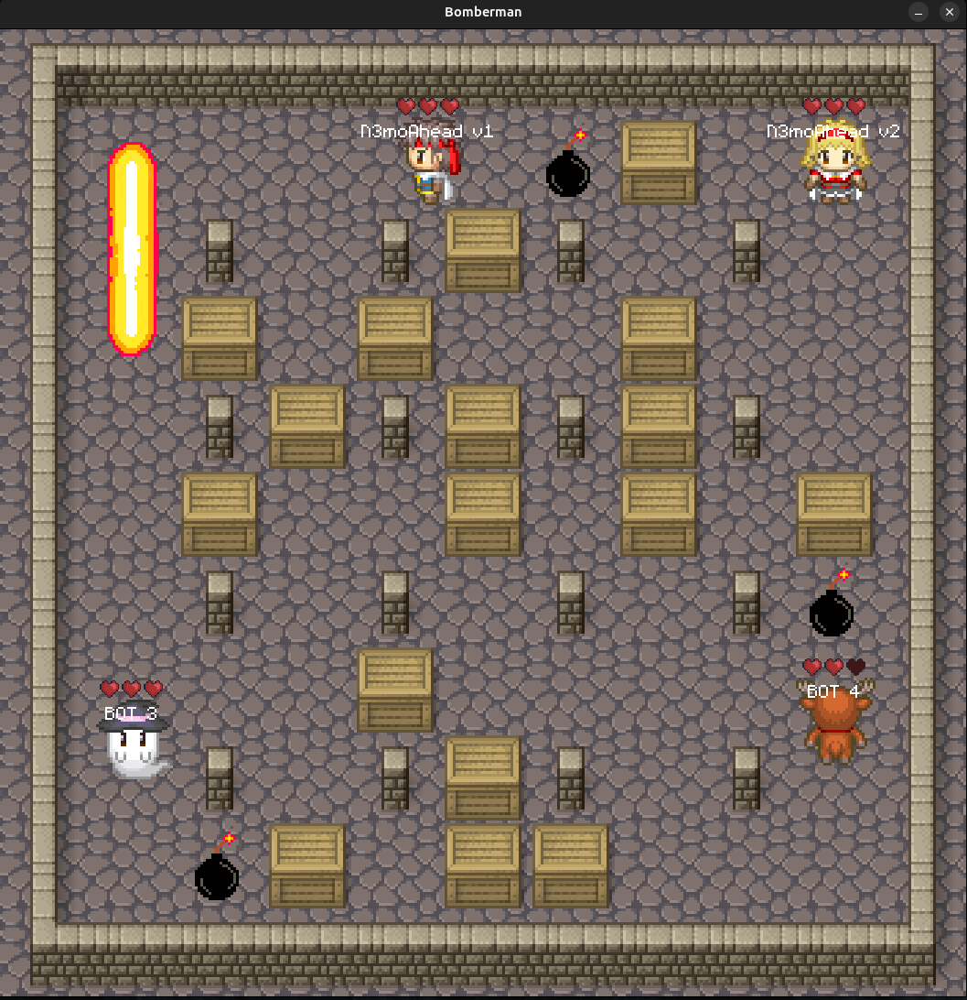

```
    ____                  __
   / __ )____  ____ ___  / /_  ___  _________ ___  ____ _____
  / __  / __ \/ __ `__ \/ __ \/ _ \/ ___/ __ `__ \/ __ `/ __ \
 / /_/ / /_/ / / / / / / /_/ /  __/ /  / / / / / / /_/ / / / /
/_____/\____/_/ /_/ /_/_.___/\___/_/  /_/ /_/ /_/\__,_/_/ /_/
```



This repository contains a client-server implementation of the classic game Bomberman. The server is written in Go, and there are example clients in Go, JavaScript, and Rust that you can use as a starting point to develop your own bot.

# Getting Started

The game consists of a central server and multiple clients (your bots). You need to run the server first, and then you can connect your clients to it.

## 1. Run the Server

The server is located in the `server/` directory.

```bash
cd server/
make run
```

The server will start and listen for connections on port `:8038`.

## 2. Run a Client

You can run one of the provided clients or create your own.

### Go Client

```bash
cd client_go/
make run
```

### JavaScript Client

```bash
cd client_js/
npm install
npm start
```

### Rust Client

```bash
cd client_rust/
cargo run
```

# How to Write a Bot

To create a bot, you'll need to grab the basic template from this repository. Once you have that, you can start developing your own logic. I'm planning to streamline the installation process in the future, but for now, this manual approach will get you up and running quickly.

First off, clone the main Bomberman repository:

```bash
# SSH
git clone git@github.com:N3moAhead/bombahead.git
# HTTPS
git clone https://github.com/N3moAhead/bombahead.git
```

The next steps depend on the language you want to use. You can currently choose between **Golang**, **Rust**, and **Javascript**.

We need to copy the starting template from the cloned repository into a new project directory.

```bash
mkdir my-own-fantastic-bot

# For Golang
cp -r bomberman/client_go/* my-own-fantastic-bot 
# For Rust
cp -r bomberman/client_rust/* my-own-fantastic-bot
# For Javascript
cp -r bomberman/client_js/* my-own-fantastic-bot
```

You are now basically ready to go. Move into your new bot directory, initialize a new Git repository, and start coding!

## Testing your bot 

It's a good idea to test your bot locally before sending it into the arena to compete against others. You can easily spin up a local testing environment using a few simple Podman commands.

First, start the game server:
```bash
podman run --detach -p 8038:8038 docker.io/nemoahead/bomberman-server:latest
```

Next, start a simple opponent. This "dummy" bot just stands still, allowing you to freely test your code without getting blown up immediately:
```bash
podman run --detach --network host docker.io/nemoahead/bomberman-client-go:idle
```

Now, you can run your own code. The game will start, and you'll see a simple display in your terminal.

```bash
# Make sure you are inside your bot directory!

# For Golang (or just "make run" if make is installed)
go run cmd/client_go/main.go
# For Rust
cargo run
# For Javascript 
npm run start
```

## Competing with your bot

To participate in the competition, we need to package your code into a Docker image. To simplify this, the templates already include a ready-to-use `Dockerfile`.

You can build your image with the following command:
```bash
podman build -t docker.io/your-username/your-bot-name:your-bot-version-tag .
```

Next, push the image to [Docker Hub](https://hub.docker.com/). You will need to create an account there if you haven't already.

Sign in to Docker Hub using Podman:
```bash
podman login docker.io
```

Once logged in, push your bot using the tag you created:
```bash
podman push docker.io/your-username/your-bot-name:your-bot-version-tag
```

Now, head over to [BombAhead](https://bombahead.n3mo.org/) and sign up with your GitHub account. You will be redirected to the bots page.

Click on **Add Bot**. Here you can give your bot a name and provide a description (perfect if you want to brag about your pathfinding algorithm).

Enter your image tag in the field provided:
`(docker.io/your-username/your-bot-name:your-bot-version-tag)`

Finally, you can indicate if you used AI to help code your bot. Click **Save**, and your bot will automatically start competing against other bots in the arena. Good luck!

## Game State (`classic_state`)

On every game tick, the server broadcasts the current game state to all clients. This message has the type `classic_state` and its payload contains the following information:

-   `players` ([]PlayerState): A list of all players currently in the game.
    -   `id` (string): The unique ID of the player.
    -   `pos` (Vec2): The `{x, y}` coordinates of the player on the map.
    -   `health` (int): The current health of the player.
    -   `score` (int): The current score of the player.
-   `field` (FieldState): The game map itself.
    -   `width` (int): The width of the map.
    -   `height` (int): The height of the map.
    -   `field` ([]Tile): A 1D array representing the 2D map. The type of each tile can be `air`, `wall`, or `box`.
-   `bombs` ([]BombState): A list of active bombs on the map.
    -   `pos` (Vec2): The `{x, y}` coordinates of the bomb.
    -   `fuse` (int): The number of ticks until the bomb explodes.
-   `explosions` ([]Vec2): A list of `{x, y}` coordinates where explosions are currently active.

## Player Actions (`classic_input`)

To control your bot, you send a message with the type `classic_input`. The payload must contain your desired move.

-   `move` (PlayerMove): The action to perform on the next tick.

Possible values for `move` are:
-   `nothing`: Do nothing for one turn.
-   `move_up`: Move one tile up.
-   `move_down`: Move one tile down.
-   `move_left`: Move one tile left.
-   `move_right`: Move one tile right.
-   `place_bomb`: Place a bomb at the player's current position.

You can study the `message.go` file in `client_go/pkg/bomber/` for the exact data structures.

# Legacy C Game

The original version of this project was a SDL-based game written entirely in C. You can still find it in the `c_game/` directory. It has its own set of rules and instructions for writing bots. If you're interested, please refer to the `README.md` inside that directory for more information.
